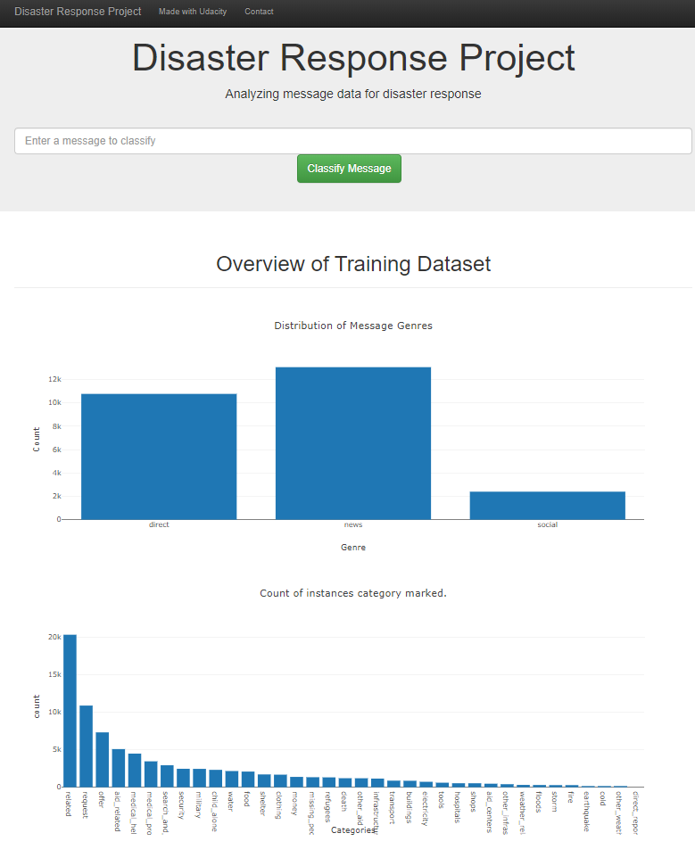
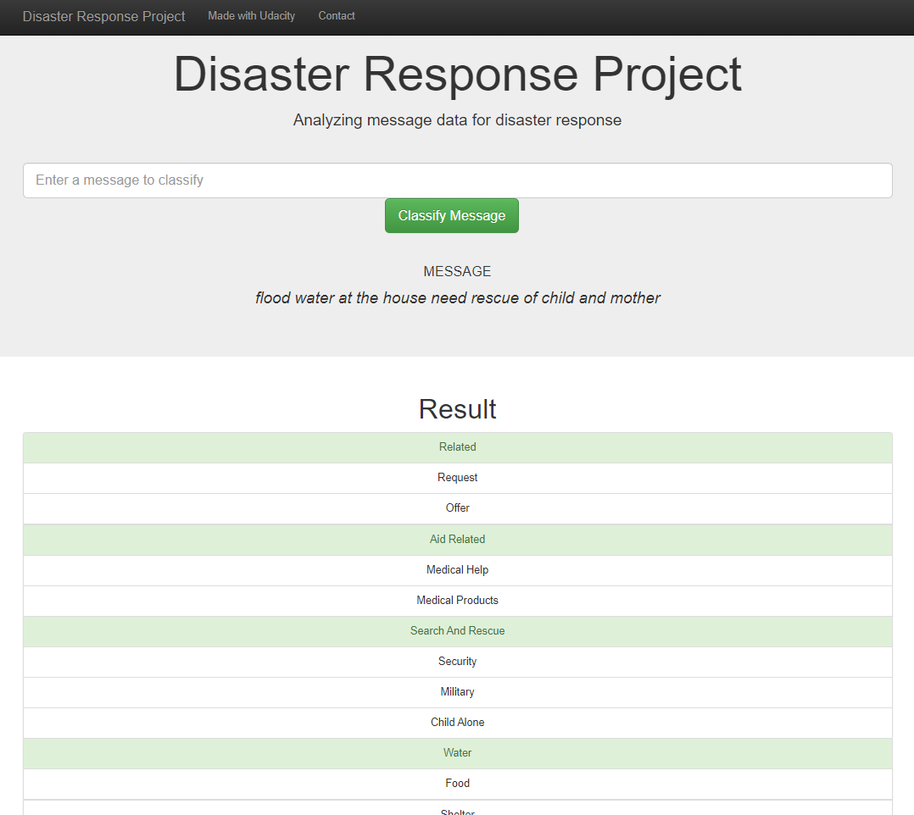

# Disaster Response Project

### Background
This project takes previously collected tweets during disasters, which have been categoriesed.  This data will need cleaning with an ETL pipeline and to be able to catagorise new unseen data develop a ML pipeline to generate a model that will be able to catagorise this data.

The machine that I was using was not able to run the GridSerchCV to get the optimal parameters for the model but what results here is a good first attempt.

### Document Structure
 * app
   * templetes
     * go.html
     * master.html
   * run.py
 * data
   * disaster_categories.csv
   * disaster_messages.csv
   * DisasterResponse.db
   * process_data.py
 * models
   * classifier.pkl
   * train_classifier.py
   

### Instructions:
1. Run the following commands in the project's root directory to set up your database and model.

    - To run ETL pipeline that cleans data and stores in database
        `python data/process_data.py data/disaster_messages.csv data/disaster_categories.csv data/DisasterResponse.db`
    - To run ML pipeline that trains classifier and saves
        `python models/train_classifier.py data/DisasterResponse.db models/classifier.pkl`

2. Run the following command in the app's directory to run your web app.
    `python run.py`

3. Go to http://0.0.0.0:3001/

#### Using the web_app
There is only one input to this prokect and that is a new message that you will enter in the text box with the contect "Enter a message to classify".  The ouptuts are shown in the next section. 

### Output
Web app image below:

#### Results once tweet has been entered

